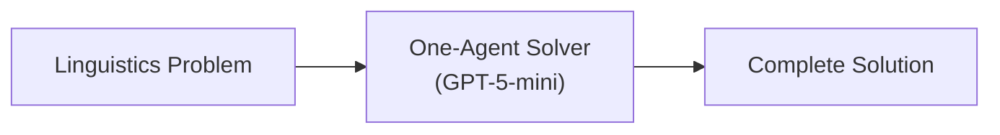

# Workflow 01. One-Agent Solver

A single-agent approach to solving **Linguistics Olympiad problems** using a methodical, data-driven analysis workflow.

## Overview

This is a baseline/simple approach that uses a single AI agent to solve linguistics puzzles end-to-end. The agent follows a structured methodology to analyze linguistic data, hypothesize rules, verify them, and produce answers—all in one pass.



## Agent

| Agent                | Model               | Purpose                                                                   |
| -------------------- | ------------------- | ------------------------------------------------------------------------- |
| **One-Agent Solver** | `openai/gpt-5-mini` | Analyzes problem, infers linguistic rules, and produces complete solution |

### Agent Characteristics

The agent is designed to be:

- **Methodical** — Fully inventories data before attempting translations
- **Skeptical** — Does not leap to interpretations; documents ambiguities explicitly
- **Rigorous** — Uses back-translation and literal gloss checks to catch errors

## Analysis Workflow

The agent follows a structured 5-step analysis process:

### 1. Tokenization & Concordance Building

- Extracts every distinct token (word/affix) from the corpus
- Creates a table listing each token with its contexts and glosses
- Goal: Resolve homonymy and spot distributional patterns

### 2. Explicit Morphological Paradigms

- Creates grids for grammatical categories (Person × Tense, Case × Number, etc.)
- Places every attested form into the grid
- Marks empty cells as "UNKNOWN" rather than guessing

### 3. Literal Morpheme-by-Morpheme Derivation

- Writes segmentation and literal word-for-word gloss for each sentence
- Verifies the natural gloss can be generated from the literal gloss
- If mismatch occurs, triggers re-segmentation

### 4. Hypothesis Testing & Falsification

- Formulates rules (e.g., "Suffix -X marks Plural")
- Performs "What-If" checks to find counter-examples
- Actively looks for data that would disprove each hypothesis

### 5. Consistency Pass

- Searches for contradictions (same morpheme with different meanings)
- Resolves ambiguities using distributional clues

## Output Structure

The agent produces a structured response with:

1. **Chain of Thought & Deliberation**
   - Token/Concordance Table
   - Paradigm Grids
   - Literal Derivations
   - Hypothesis Testing
   - Uncertainty Log

2. **Concise Solution Summary**
   - 2–4 bullets summarizing core grammar/rules

3. **Solution Steps**
   - Numbered sequence showing rule derivations

4. **Verification Table**
   - Columns: Original Form | Gloss | Derivation Check
   - Marks whether each derivation matches provided data

5. **Final Answer**
   - Compact block with only the requested answers
   - Format: `1. [Item Reference] -> [Answer]`

6. **Confidence & Uncertainty**
   - Score: High/Medium/Low
   - Rationale explaining the confidence level

## File Structure

```
01-one-agent/
├── index.ts                           # Exports agent for Mastra registration
├── one-agent-solver-agent.ts          # Agent definition with model and scorers
├── one-agent-solver-instructions.ts   # Detailed prompt/instructions for the agent
├── one-agent-solver-scorers.ts        # Evaluation scorers (completeness)
└── README.md                          # This file
```

## Scorers

The agent uses Mastra's evaluation framework:

| Scorer               | Sampling        | Purpose                         |
| -------------------- | --------------- | ------------------------------- |
| `completenessScorer` | 100% (ratio: 1) | Evaluates response completeness |

## Core Principles

The agent operates under these guiding principles:

- **Maximally Data-Driven** — Never adopts a hypothesis without exhaustively checking every occurrence
- **Systematize Everything** — Uses tables, paradigms, and concordances instead of mental notes
- **Parsimony with Nuance** — Prefers simple explanations (Occam's Razor) but allows item-specific rules
- **Explicit Uncertainty** — Marks uncertain analyses and keeps alternatives explicit
- **Back-Translation** — Always back-translates derived answers to verify correctness

## Usage

```typescript
import { Mastra } from '@mastra/core';
import { oneAgentSolverAgents } from './01-one-agent';

const mastra = new Mastra({
  agents: oneAgentSolverAgents,
});

// Use the agent directly
const agent = mastra.getAgent('wf01_oneAgentSolverAgent');
const response = await agent.generate('... your linguistics problem text ...');
```
