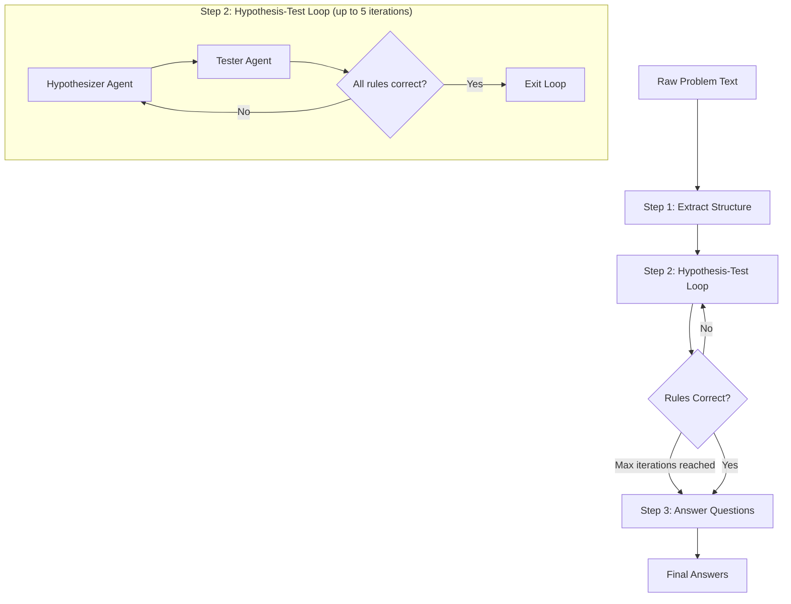

# Workflow 02. Extract-Then-Hypothesis-Test Loop Workflow

## Overview

This workflow automates the process of solving linguistic puzzles by extracting structured data from problem text, hypothesizing linguistic rules, testing those rules against the dataset, and finally answering the questions using validated rules.



## Agents

The workflow uses **4 specialized AI agents**, each with a distinct role:

| Agent                            | Model                         | Purpose                                                                    |
| -------------------------------- | ----------------------------- | -------------------------------------------------------------------------- |
| **Structured Problem Extractor** | `openai/gpt-5-mini`           | Parses raw problem text into structured JSON (context, dataset, questions) |
| **Rules Hypothesizer**           | `google/gemini-3-pro-preview` | Analyzes dataset to hypothesize linguistic rules and extract vocabulary    |
| **Rules Tester**                 | `google/gemini-3-pro-preview` | Validates hypothesized rules against the dataset                           |
| **Question Answerer**            | `google/gemini-3-pro-preview` | Applies validated rules to answer the problem's questions                  |

## Workflow Steps

### Step 1: Extract Structure

The **Structured Problem Extractor Agent** parses the raw problem text and extracts:

- **Context**: Linguistic notes (orthography, grammar hints, special instructions)
- **Dataset**: Array of paired data items (foreign phrases ↔ English translations)
- **Questions**: Specific translation/fill-in-the-blank tasks to solve

### Step 2: Hypothesis-Test Loop

This is the core of the workflow—an iterative cycle that refines linguistic rules:

1. **Hypothesizer Agent** analyzes the dataset and generates:
   - Linguistic rules (word order, morphology, phonology, etc.)
   - Vocabulary list (morpheme-to-meaning mappings)

2. **Tester Agent** validates the rules by:
   - Testing each rule against all dataset items
   - Checking for inconsistencies, gaps, or errors
   - Returning one of: `"All rules correct"`, `"Insufficient rules"`, or `"Some rules incorrect"`

3. If rules are not perfect, the loop continues (up to 5 iterations) with the Hypothesizer receiving feedback from the Tester to revise the rules.

### Step 3: Answer Questions

Once rules pass validation (or max iterations reached), the **Question Answerer Agent**:

- Applies the validated rules to each question
- Provides step-by-step working showing morpheme segmentation and rule application
- Returns final answers with detailed glosses

## File Structure

```
02-extract-then-hypo-test-loop/
├── index.ts                                    # Exports agents for Mastra registration
├── workflow.ts                                 # Main workflow definition and step logic
├── structured-problem-extractor-agent.ts       # Agent 1: Extracts structure from raw text
├── structured-problem-extractor-instructions.ts # Instructions for Agent 1
├── rules-hypothesizer-agent.ts                 # Agent 2a: Hypothesizes linguistic rules
├── rules-hypothesizer-instructions.ts          # Instructions for Agent 2a
├── rules-tester-agent.ts                       # Agent 2b: Tests/validates rules
├── rules-tester-instructions.ts                # Instructions for Agent 2b
├── question-answerer-agent.ts                  # Agent 3: Answers questions using rules
├── question-answerer-instructions.ts           # Instructions for Agent 3
└── README.md                                   # This file
```

## Schemas

The workflow uses Zod schemas to enforce structured outputs:

| Schema                    | Purpose                                                 |
| ------------------------- | ------------------------------------------------------- |
| `rawProblemInputSchema`   | Workflow input (raw problem text)                       |
| `structuredProblemSchema` | Output of extraction step (context, dataset, questions) |
| `rulesSchema`             | Hypothesized rules and vocabulary                       |
| `rulesTestResultsSchema`  | Test results (conclusion + explanation)                 |
| `questionsAnsweredSchema` | Final answers with working steps                        |

## Logging

The workflow generates detailed Markdown logs in the `logs/` directory (or path specified in `LOG_DIRECTORY` env variable):

- Each step's agent output and reasoning
- Validation errors (if any)
- Timing summary table showing duration of each step

Log files are named: `workflow-02_YYYY-MM-DD_HH-MM-SS.md`

## Configuration

| Environment Variable | Description                                               |
| -------------------- | --------------------------------------------------------- |
| `OPENROUTER_API_KEY` | Required. API key for OpenRouter                          |
| `LOG_DIRECTORY`      | Optional. Custom log output directory (default: `./logs`) |

## Usage

This workflow is designed to be registered with Mastra and executed via the Mastra CLI or API.

```typescript
import { Mastra } from '@mastra/core';
import {
  extractThenHypoTestLoopWorkflow,
  extractThenHypoTestLoopWorkflowAgents,
} from './02-extract-then-hypo-test-loop';

const mastra = new Mastra({
  agents: extractThenHypoTestLoopWorkflowAgents,
  workflows: { extractThenHypoTestLoopWorkflow },
});

// Execute the workflow
const result = await mastra.runWorkflow('02-extract-then-hypo-test-loop-workflow', {
  inputData: {
    rawProblemText: '... your linguistics problem text ...',
  },
});
```

## Example Input/Output

### Input

```json
{
  "rawProblemText": "Here are some sentences in Swahili:\n1. Juma anapenda kusoma - Juma likes to read\n2. Watoto wanacheza - The children are playing\n\nTranslate:\n3. Juma anacheza - ?"
}
```

### Output

```json
{
  "success": true,
  "explanation": "Successfully answered all questions using the provided rules.",
  "answers": [
    {
      "questionId": "Q1",
      "answer": "Juma is playing",
      "workingSteps": "Input: Juma anacheza\n\nStep 1: Word segmentation\n  Juma ana-cheza\n\nStep 2: Identify morphemes\n  - 'Juma' = proper noun (name)\n  - 'ana-' = 3SG present progressive marker\n  - 'cheza' = 'play' (verb root)\n\nStep 3: Apply word order rule (SVO)\n  Subject + Verb\n\nFinal: Juma is playing"
    }
  ]
}
```

## Iteration Limit

The hypothesis-test loop runs for a maximum of **5 iterations** (`MAX_HYPOTHESIS_TEST_ITERATIONS`). If rules are still not perfect after 5 iterations, the workflow proceeds to answer questions with the best available rules.
