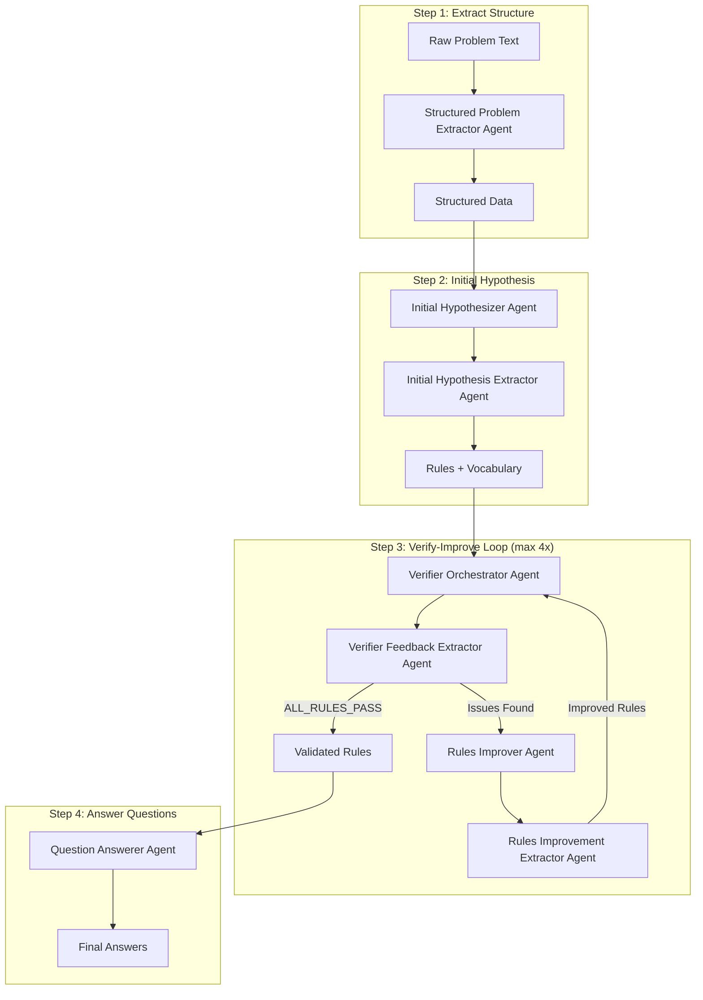
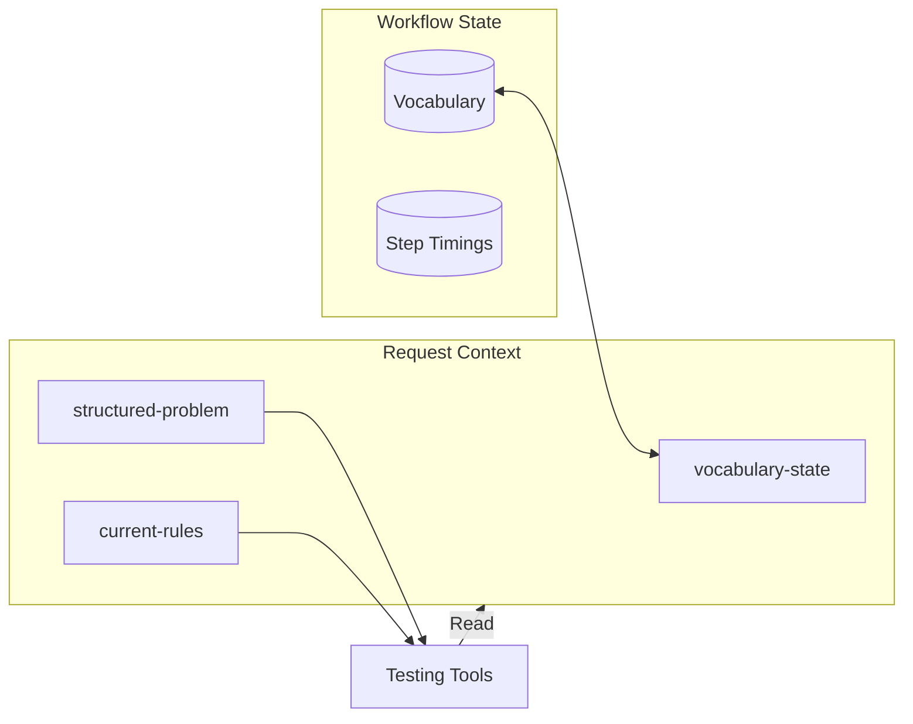

# Workflow 03: Per-Rule-Per-Sentence Delegation

A multi-agent workflow for solving linguistic analysis problems through an iterative hypothesis-verification loop.

## Overview

This workflow takes raw linguistics problem text and:

1. Extracts structured data from the problem
2. Generates initial grammar rules and vocabulary
3. Iteratively verifies and improves rules (up to 4 iterations)
4. Answers questions using validated rules

## Workflow Architecture



## Agents

| Agent                        | File                                        | Purpose                                              |
| ---------------------------- | ------------------------------------------- | ---------------------------------------------------- |
| Structured Problem Extractor | `01-structured-problem-extractor-agent.ts`  | Parses raw text into context, dataset, and questions |
| Initial Hypothesizer         | `02-initial-hypothesizer-agent.ts`          | Generates first set of grammar rules                 |
| Initial Hypothesis Extractor | `02a-initial-hypothesis-extractor-agent.ts` | Extracts JSON from hypothesizer's output             |
| Verifier Orchestrator        | `03a-verifier-orchestrator-agent.ts`        | Tests rules using testRule/testSentence tools        |
| Verifier Feedback Extractor  | `03a2-verifier-feedback-extractor-agent.ts` | Extracts structured feedback from verifier           |
| Rule Tester                  | `03a-rule-tester-agent.ts`                  | Tests a single rule against dataset                  |
| Sentence Tester              | `03a-sentence-tester-agent.ts`              | Tests sentence translation using rules               |
| Rules Improver               | `03b-rules-improver-agent.ts`               | Improves rules based on verification feedback        |
| Rules Improvement Extractor  | `03b2-rules-improvement-extractor-agent.ts` | Extracts improved rules JSON                         |
| Question Answerer            | `04-question-answerer-agent.ts`             | Answers questions using validated rules              |

## Tools

### Testing Tools (`testing-tools.ts`)

Used by the Verifier Orchestrator to test rules:

| Tool                      | Description                                                            |
| ------------------------- | ---------------------------------------------------------------------- |
| `testRule`                | Tests a single rule against dataset with full ruleset context          |
| `testSentence`            | Tests sentence translation (blind - agent doesn't see expected answer) |
| `testRuleWithRuleset`     | Same as testRule but accepts ruleset as parameter                      |
| `testSentenceWithRuleset` | Same as testSentence but accepts ruleset as parameter                  |

### Vocabulary Tools (`vocabulary-tools.ts`)

Manage vocabulary state during hypothesis generation:

| Tool               | Description                   |
| ------------------ | ----------------------------- |
| `addVocabulary`    | Add/update vocabulary entries |
| `removeVocabulary` | Remove vocabulary entries     |
| `getVocabulary`    | Retrieve current vocabulary   |

## Data Flow



## Key Design Decisions

### Blind Sentence Testing

The sentence tester agent translates **without** seeing the expected answer. After translation, the tool compares results post-hoc. This prevents bias in the agent's output.

### Dual-Agent Pattern

Most steps use a dual-agent pattern:

1. **Reasoning Agent**: Generates natural language analysis with flexible format
2. **Extractor Agent**: Converts reasoning output to structured JSON

This allows rich reasoning while ensuring machine-readable outputs.

### RequestContext for Tool State

Tools access shared state (vocabulary, rules, problem data) via `RequestContext`, enabling stateless tool definitions with stateful execution.

## File Structure

```
03-per-rule-per-sentence-delegation/
├── workflow.ts                           # Main workflow definition
├── index.ts                              # Agent/tool exports
├── request-context-helpers.ts            # RequestContext utilities
├── request-context-types.ts              # TypeScript types for context
├── vocabulary-tools.ts                   # Vocabulary management tools
├── vocabulary-tools-prompt.ts            # Vocabulary tool instructions
├── testing-tools.ts                      # Rule/sentence testing tools
├── shared-memory.ts                      # Shared memory utilities
│
├── 01-structured-problem-extractor-*.ts  # Step 1: Parse raw input
├── 02-initial-hypothesizer-*.ts          # Step 2: Generate initial rules
├── 02a-initial-hypothesis-extractor-*.ts # Step 2: Extract rules JSON
├── 03a-verifier-orchestrator-*.ts        # Step 3a: Verify rules
├── 03a2-verifier-feedback-extractor-*.ts # Step 3a: Extract feedback
├── 03a-rule-tester-*.ts                  # Testing tool: single rule
├── 03a-sentence-tester-*.ts              # Testing tool: single sentence
├── 03b-rules-improver-*.ts               # Step 3b: Improve rules
├── 03b2-rules-improvement-extractor-*.ts # Step 3b: Extract improved rules
└── 04-question-answerer-*.ts             # Step 4: Answer questions
```
